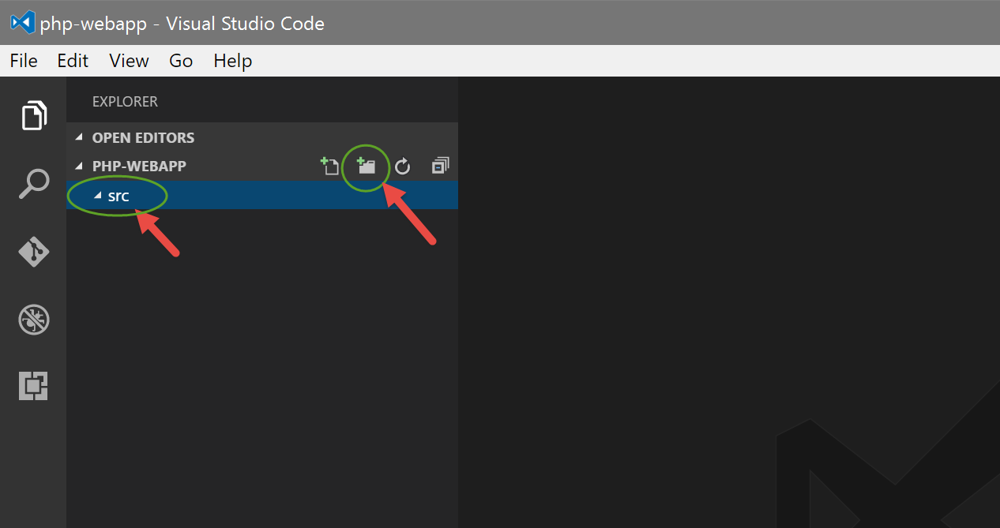
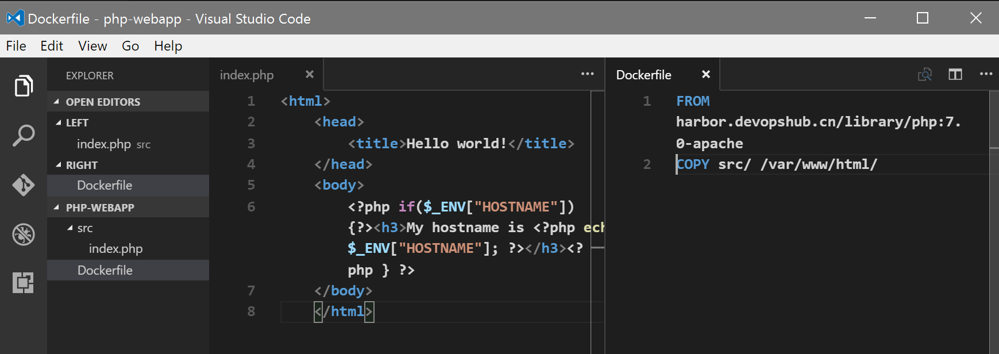
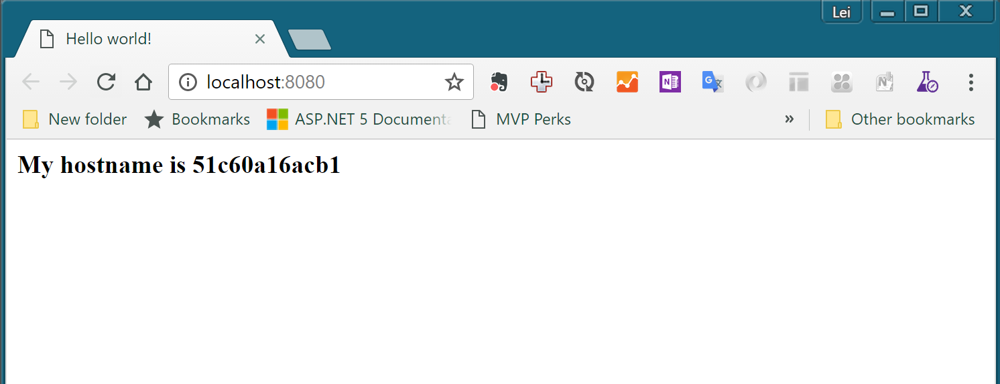
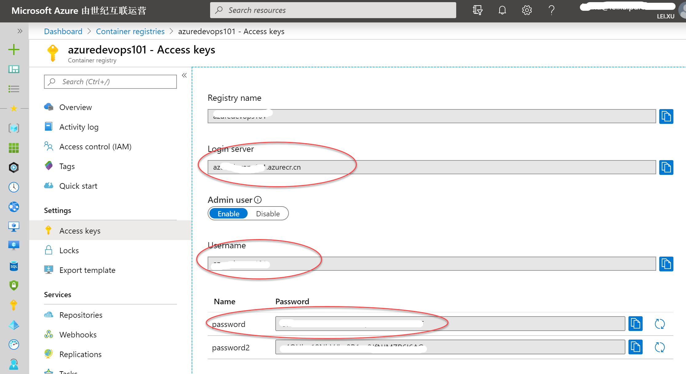

# Docker容器化开发基础操作实验

本实验帮助你对使用Docker进行容器化开发的基础操作进行了解, 让你具备对Docker和容器的基础了解.

## 本地Docker开发环境安装与配置

**系统要求**: 请确保满足以下系统要求

Windows 10 专业版／企业版 64-bit 或者 MacOS

### 1.下载Docker for windows

在Docker官网上找到 Docker Desktop,根据自己的操作系统类型下载并安装

<https://www.docker.com>

### 2.测试docker是否安装成功

打开CMD，输入docker ps，结果如下，则说明安装成功。

```bash
CONTAINER ID        IMAGE                                            COMMAND                  CREATED             STATUS              PORTS               NAMES
```

### 3.获取Docker镜像仓库资源

获取免费的Azure云账号, Azure为开发者提供200美金的免费试用资源, 任何人都可以免费申请.

免费获取地址 <https://azure.com/free>

申请账号后, 在Azure Portal <https://portal.azure.com> 中找到 Azure Container Registry 资源类型, 并新建一个自己的 Registry 实例.

## 练习一：使用docker基本命令

### 01. 使用容器运行Hello World

使用命令行运行以下命令，此命令将启动一个ubuntu的容器并在其中输出 Hello World文本，执行完毕后，容器自动退出。

```bash
$ docker run ubuntu /bin/echo 'Hello world'
Hello world
```

### 02. 与容器进行交互

使用命令行运行以下命令，此命令将启动一个ubuntu容器并在其中运行bash交互命令行界面，你可以尝试运行pwd，ls，ps等命令查看容器内环境，就如同远程操作一台服务器一样。

| 参数                   | 解释 |
| ---------------------- | -------------------------------------------------------- |
| -i (--Interactive)  |  将容器的标准输入保持打开 |
| -t (--tty)          | 分配一个伪终端（pseudo-tty）并绑定到容器的标准输入上。 |

```bash
$ docker run -t -i ubuntu /bin/bash
root@af8bae53bdd3:/#
```

### 03. 在容器中运行持续任务并管理容器生命周期

使用命令行运行以下命令，此命令将启动一个ubuntu容器并在其中持续运行echo hello world，启动后容器会持续输出hello world文本。

| 参数            | 解释 |
| --------------- | ------------------- |
| -d (--detach) |  在后台运行容器 |

```bash
$ docker run -d ubuntu /bin/sh -c "while true; do echo hello world; sleep 1; done"
1e5535038e285177d5214659a068137486f96ee5c2e85a4ac52dc83f2ebe4147
```

> 注意: 当你运行以上命令后，命令行直接退出并没有持续输出hello world文本，这是因为我们使用了-d参数，这时容器在后台运行，你可以通过docker logs命令获取容器内的日志输出，注意替换c3a2为你的容器ID的前四位，如下：

```bash
$ docker logs -f c3a2
hello world
hello world
hello world
hello world
hello world
hello world
... 
```

为了查看当前正在运行状态的容器，你可以使用docker ps命令，如下：

```bash
$ docker ps
CONTAINER ID        IMAGE               COMMAND                  CREATED                  STATUS              PORTS               NAMES
c3a251374851        ubuntu              "/bin/sh -c 'while..."   Less than a second ago   Up 2 minutes                            evil_ride
```

你也可以查看到那些没有在运行状态的容器，使用docker ps -a命令，如下：

| 参数         | 解释  |
| ------------ | -- ------------------------------------------ |
| -a (--all) |  显示所有的容器，包括运行中以及停止的容器 |

```bash
$ docker ps -a
CONTAINER ID        IMAGE               COMMAND                  CREATED                  STATUS                     PORTS               NAMES
c3a251374851        ubuntu              "/bin/sh -c 'while..."   Less than a second ago   Up 6 minutes                                   evil_ride
b6d4324edfbc        ubuntu              "/bin/bash"              Less than a second ago   Exited (0) 6 minutes ago                       small_beaver
3363b0a14324        ubuntu              "/bin/echo 'Hello ..."   Less than a second ago   Exited (0) 7 minutes ago                       hungry_stonebraker
```

> 注意: 以上除了第一个容器正在运行意外，另外2个ubuntu容器都已经停止，但是容器仍然存在。你可以理解为他们是没有被运行中的应用，而应用的文件存在于你的docker环境中。

现在，你可以通过docker stop {id}命令来停止正在运行的容器，如下：

```bash
λ docker stop c3a2
c3a2
```

然后，通过docker rm {id}命令来删除所有未运行的容器，注意将id替换成你自己的容器ID的前四位，如下：

```bash
λ docker rm c3a2 b6d4 3363
c3a2
b6d4
3363
```

也可以通过这个命令自动枚举所有容器并停止，删除：

在Windows上使用以下命令：

```bash
FOR /f "tokens=*" %i IN ('docker ps -a -q') DO docker stop %i
FOR /f "tokens=*" %i IN ('docker ps -a -q') DO docker rm %i
```

在Mac/Linux上使用以下命令：

```bash
docker stop $(docker ps -qa)
docker rm $(docker ps -qa)
```

### 练习一小结

至此，你应该已经基本掌握了运行容器的主要命令，下一节中，我们将尝试完成一个新的容器镜像的构建并运行我们自己构建的容器镜像。

## 练习二：使用docker build来构建容器镜像并运行

实验准备

请使用以下命令清理本地docker环境，确保后续实验的正确运行

在Windows上使用以下命令：

```bash
FOR /f "tokens=*" %i IN ('docker ps -a -q') DO docker stop %i
FOR /f "tokens=*" %i IN ('docker ps -a -q') DO docker rm %i
```

在Mac/Linux上使用以下命令：

```bash
docker stop $(docker ps -qa)
docker rm $(docker ps -qa)
```

### 01. 准备容器开发环境

在磁盘上建立docker-training目录，并在其中创建php-webapp目录，然后输入code .启动 Visual Studio Code 并打开php-webapp作为工作目录

``` bash
λ mkdir docker-training
λ cd docker-training\
λ mkdir php-webapp
λ cd php-webapp\
λ code .
```

在 Visual Studio Code 中点击新建文件夹按钮，创建src目录用来存放源代码



### 02. 创建项目代码

分别创建以下文件



请注意文件的位置，一个在src目录中，另外一个在根目录

src/index.php

```
<html>
<head>
    <title>Hello world!</title>
</head>
<body>
    <h3>My hostname is <?php echo getenv('HOSTNAME'); ?></h3>
</body>
</html>
```

Dockerfile

``` bash
FROM php:7.1-apache
COPY src/ /var/www/html/
```

### 03. 构建容器镜像

进入/docker-training/php-webapp目录，并执行命令完成容器镜像的构建

注意以下命令中的第二行，末尾有一个符号 .代表使用当前路径的Dockerfile进行构建

  | 参数         |  解释             |
  | ------------ | -----------------------------  |
  | -t (--tag) |  为要构建的镜像指定一个名称  |

``` bash
D:\docker-training\php-webapp
λ docker build -t php-webapp:1 .
```

执行结果如下，你可以看到这个命令执行了3部分内容

1. 将我们应用程序的内容上传至docker daemon
2. 从我们的私有镜像仓库拉取了Dockerfile里面所定义的基础镜像(FROM)
3. 按照Dockerfile里面所定义的步骤完成打包操作

``` bash
Sending build context to Docker daemon 3.584 kB
Step 1/2 : FROM php:7.1-apache
7.0-apache: Pulling from library/php
386a066cd84a: Already exists
269e95c6053a: Already exists
6243d5c57a34: Already exists
872f6d38a33b: Already exists
e5ea5361568c: Already exists
f81f18e77719: Already exists
f9dbc878ca0c: Already exists
195935e4100b: Already exists
935d0c2409b2: Pull complete
d14786710093: Pull complete
b7dff268d83a: Pull complete
d1083150956d: Pull complete
9284aa2927a6: Pull complete
Digest: sha256:05fe69944d513bd618ad81cf6160e2f0e8237a3abf8383c816b8bbbc5ff83418
Status: Downloaded newer image for php:7.1-apache
---> 336e2be8a343
Step 2/2 : COPY src/ /var/www/html/
---> 0996039f9f99
Removing intermediate container f5f368e823a1
Successfully built 0996039f9f99
```

完成后，使用docker images {镜像名称} 命令来查看构建好的容器镜像

``` bash
λ docker images php-webapp
REPOSITORY          TAG                 IMAGE ID            CREATED                  SIZE
php-webapp          1                   0996039f9f99        Less than a second ago   403 MB
```

### 04. 运行我们的容器镜像

完成以上容器镜像构建后，我们就可以使用docker run来运行我们的应用了

``` bash
λ docker run -itd -p 8080:80 php-webapp:1
51c60a16acb1fa17655470cf6304803f738f6f576e7e3d250fba865c0ff5be72
```

运行以上命令后打开浏览器并导航至 <http://localhost:8080>，你将看到刚才我们所编写的index.php的内容



### 05. 修改代码并重新打包并运行

完成以上步骤后，你就可以按照日常开发的流程，修改代码，构建容器，运行容器来完成应用的开发和调试工作了。请注意在每次构建容器镜像的时候将标签号码增加或者设置为自己认为合适的值，这样便于你管理自己的容器镜像。重复几次构建后，再使用docker
images php-webapp命令的效果应该类似如下输出。

``` bash
λ docker images php-webapp
REPOSITORY          TAG                 IMAGE ID            CREATED                  SIZE
php-webapp          1                   0996039f9f99        Less than a second ago   403 MB
php-webapp          2                   0996039f9f99        Less than a second ago   403 MB
php-webapp          3                   0996039f9f99        Less than a second ago   403 MB
```

### 06. 推送容器镜像到镜像仓库

进入 Azure Portal <https://portal.azure.com> 并进入之前创建的 Azure Container Registry 示例, 点击左侧的 Access Key 页面, 从页面中获取如下信息:



- Login Server
- Username
- Password (任选一个均可)

在命令行中完成对此 Azure Container Registry 的认证操作

``` bash
λ docker login <Login Server>
## 按照提示输入用户名和密码
```

使用 docker tag 命令配置镜像使用远程镜像仓库

``` bash
docker tag php-webapp:1 <Login Server>/php-webapp:1
##重复以上命令将我们构建的版本都1,2,3都标注成使用远程镜像仓库
```

使用 docker push 命令推送镜像到远程进项仓库

``` bash
docker push <Login Server>/php-webapp:1
docker push <Login Server>/php-webapp:2
docker push <Login Server>/php-webapp:3
## 注意观察在推送2,3的时候与推送1的时候的日志差异
```

登录远程服务器, 拉取镜像并启动镜像运行

**注意:** 假设你已经开启了远程服务器的80,81,82三个端口, 以下将本将会在3个端口上分别运行我们的应用的三个版本.

``` bash
ssh <username>@<your docker host address>
docker run -itd -p 80:80 <Login Server>/php-webapp:1
docker run -itd -p 81:80 <Login Server>/php-webapp:2
docker run -itd -p 82:80 <Login Server>/php-webapp:3
```

### 练习二小结

至此，我们就完成了一个简单的php web应用的容器化打包和运行过程。如果你本地没有安装php环境，你就会注意到使用容器进行应用开发，打包和运行的好处。我们不需要再根据自己所开发的应用来繁琐重复的配置自己的开发、测试和运行环境，所有的应用依赖都可以运行在容器中。这样做我们既简化了开发环境的配置，也防止了应为华宁不一致而造成的很多问题。

在下一节中，我们将使用docker-machine命令来管理容器化主机，容器化主机是容器运行的环境，通过docker-machine我们就可以统一管理这些主机，让我们可以将自己构建好的容器镜像发送到不同的主机上去运行
