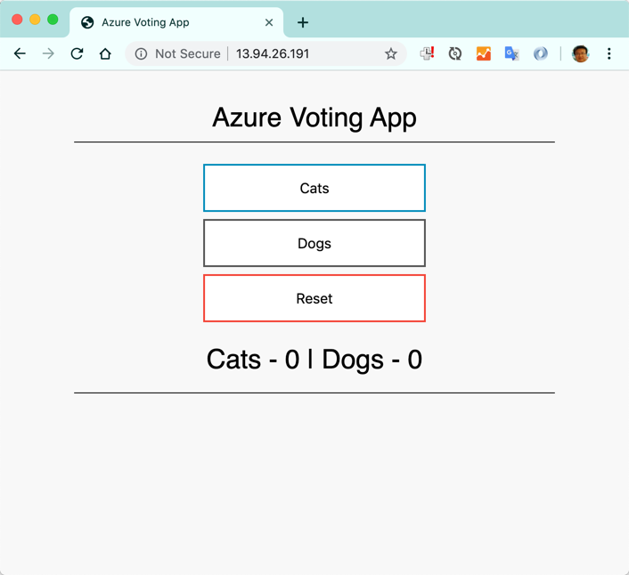

# 创建AKS集群并部署应用

本实验是最基础的AKS操作，我们通过将一个简单的应用使用docker进行构建，然后创建镜像仓库（Azure Container Registry ACR）并推送镜像，创建全新的Azure Kubernetes Services集群，最终将应用部署至集群。

## 前期准备

完成此实验需要一下资源或前提条件

1. Azure 全球版账号以及一个可用的订阅，请确保订阅中有足够的费用额度支撑部署。
2. Visual Studio Code 或其他常用编辑器
3. Azure CLI
4. Docker Desktop (for Windows/Mac)
5. Git

## 操作步骤

### 步骤1 - 获取示例代码并完成本地编译调试

运行一下命令获取示例代码

```shell
git clone https://github.com/Azure-Samples/azure-voting-app-redis.git
```

在本地环境编译并运行代码，验证应用可以正常运行

```sehll
cd azure-voting-app-redis
docker-compose up -d
```

以上命令将自动完成基础镜像的获取和应用代码的编译，打包和运行，并将应用在本地环境的8080端口启动。

打开 <http://localhost:8080>，确认可以看到如下界面


### 步骤2 - 创建Azure容器镜像仓库 (Azure Container Registry)

```shell
## azure cli登录
az login
## 创建资源组
az group create --name myResourceGroup --location eastasia
## 创建ACR
az acr create --resource-group myResourceGroup --name <acrname> --sku Basic
## 登录到ACR
az acr login --name <acrname>
## 获取ACR地址
az acr list --resource-group myResourceGroup --query "[].{acrLoginServer:loginServer}" --output table
```

### 步骤3 - 设置镜像推送路径并推送镜像

```shell
docker tag azure-vote-front <acrname>.azurecr.io/azure-vote-front:v1
docker push <acrname>.azurecr.io/azure-vote-front:v1
```

获取ACR上面的镜像信息

```shell
az acr repository list --name <acrname> --output table
az acr repository show-tags --name <acrname> --repository azure-vote-front --output table
```

### 步骤4 - 创建Azure Kubernetes Services集群

创建服务账号 Service Principle

```shell
az ad sp create-for-rbac --skip-assignment
```

记录服务账号内容
{
  "appId": "<appId>",
  "displayName": "azure-cli-2019-09-22-04-25-12",
  "name": "http://azure-cli-2019-09-22-04-25-12",
  "password": "<password>",
  "tenant": "<tenant>"
}

设置服务账号可以使用ACR上面的镜像

```shell
## 获取 <acrId>，这是个很长的地址
az acr show --resource-group myResourceGroup --name <acrName> --query "id" --output tsv
az role assignment create --assignee <appId> --scope <acrId> --role acrpull
```

创建 AKS 集群

```shell
az aks create \
    --resource-group myResourceGroup \
    --name myAKSCluster \
    --node-count 2 \
    --service-principal <appId> \
    --client-secret <password> \
    --generate-ssh-keys \
    --node-vm-size Standard_DS2_v2 \
    --location eastasia
```

安装Kubectl CLI工具并获取k8s访问密钥

```shell
az aks install-cli
az aks get-credentials --resource-group myResourceGroup --name myAKSCluster
## 获取k8s节点列表，确保这里可以显示2个节点的信息
kubectl get nodes
```

### 步骤4 - 部署应用

编辑部署配置文件azure-vote-all-in-one-redis.yaml，更新其中的<acrname>为刚才所创建的ACR名称。

类似如下：

```yaml
containers:
- name: azure-vote-front
  image: <acrName>/azure-vote-front:v1
```

完成部署

```shell
##启动部署
kubectl apply -f azure-vote-all-in-one-redis.yaml
##检查 pods 状态，可以添加 --watch 持续观察
kubectl get pods
## 检查 service 状态，添加--watch一直等待 EXTERNAL-IP 显示出地址
kubectl get service azure-vote-front --watch
NAME               TYPE           CLUSTER-IP    EXTERNAL-IP   PORT(S)        AGE
azure-vote-front   LoadBalancer   10.0.38.240   <pending>     80:31675/TCP   79s
azure-vote-front   LoadBalancer   10.0.38.240   <service-ip>   80:31675/TCP   95s
```

使用浏览器打开 <http://service-ip>，确保可以看到如下界面



**完成**
